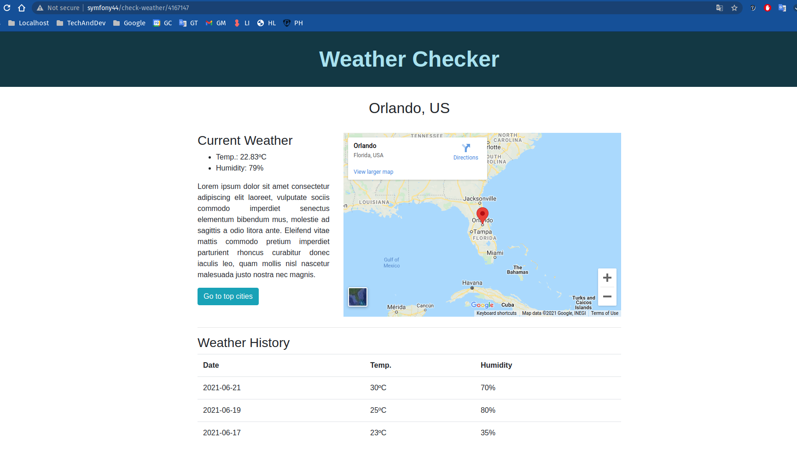

# weather-checker
Proyecto presentado como prueba tecnica de desarrollo php

# Info. Técnica
- PHP 7.4 
- MySQL 5.7 / MariaDB 10.5.10 
  - **database/weatherchecker.sql**
- Symfony 4.4 

# Info. Funcional
El proyecto WeatherChecker consta de dos páginas:
1. Homepage que presenta información climatolóciga de tres ciudades principales bajo el título "Top Cities". La visualización de estas ciudades es configurable en **config/services.yaml** bajo la llave top_cities.

2. Pagina de visualización detallada de cada ciudad con información histórica (previamente guardada en base de datos)

